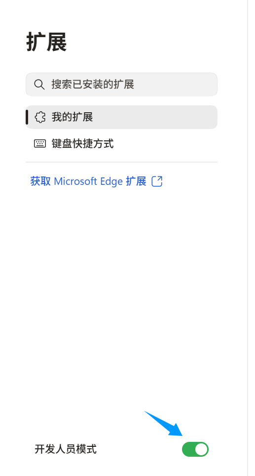
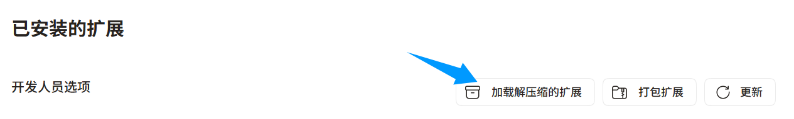
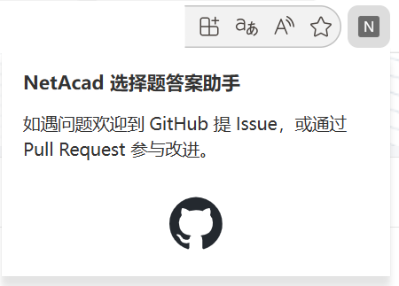

# NetAcad 习题答案获取助手（浏览器扩展）

在 `https://www.netacad.com` 课程页拉取 `components.json`，根据当前页面上的题干等文案匹配选择题，在右下角浮层显示**参考答案**与选项说明。

## 安装（Chrome / Edge）

1. 打开 **扩展程序**：`chrome://extensions/` 或 `edge://extensions/`  

2. 开启 **开发者模式**

   > 

3. **加载解压缩的扩展**，选择本目录（内含 `manifest.json` 的 `netacad-answer-helper` 文件夹）

   > 

安装或更新后，**刷新**正在打开的课程页。

## 使用

1. 做题时点击右下角 **答**。展开卡片查看答案，**×** 收起。  

   > 

2. **扩展图标弹窗** 提供仓库链接（Issue / Pull Request）；安装或更新后若行为异常请 **刷新课程页**。  

   > 
